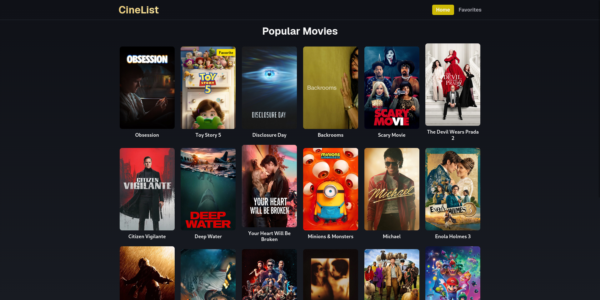
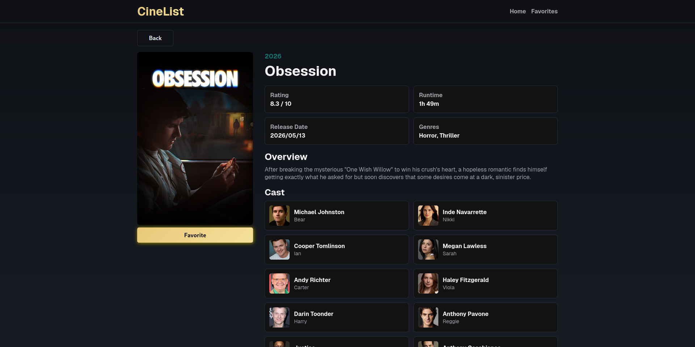
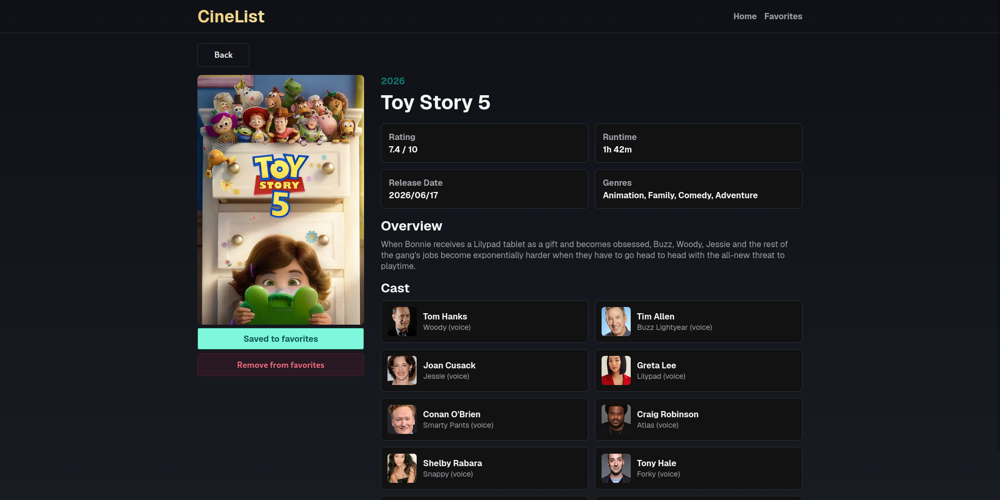
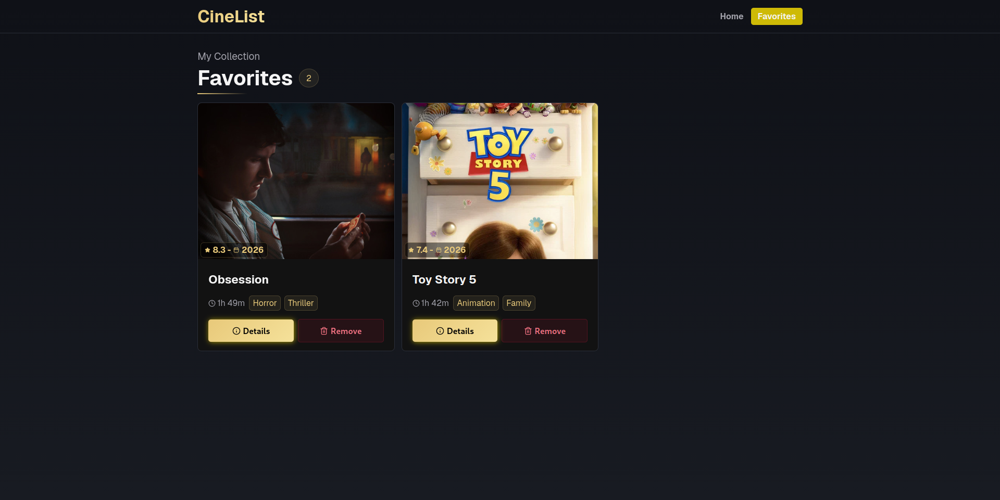
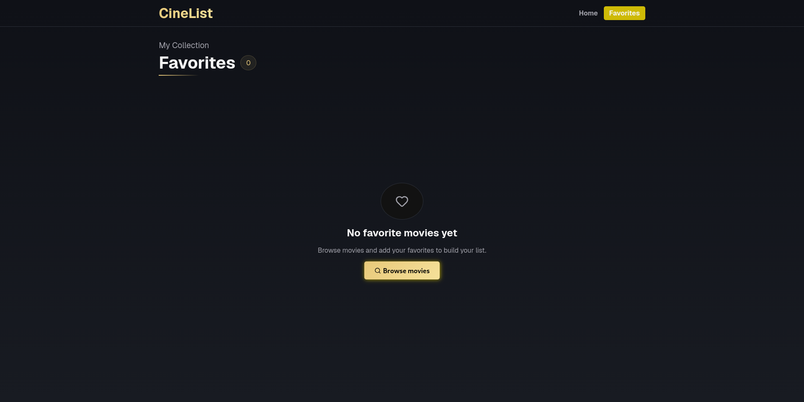

# CineList

CineList is a movie catalog web application built with React, Vite, and TypeScript. It uses the TMDB API to display popular movies, show detailed movie information, and let users manage a local favorites list.

## Overview

The application lets users browse popular movies, open a detail page for each title, save movies as favorites, and review their saved movies on a dedicated favorites page.

Favorites are stored in `localStorage` and synchronized through the favorites context, so updates are reflected across the application and browser tabs.

## Features

- Browse popular movies from TMDB.
- View movie details, including poster, overview, rating, genres, runtime, release date, and cast.
- Add movies to favorites from the movie details page.
- Remove movies from favorites from the details page or favorites page.
- Persist favorite movies in `localStorage`.
- Synchronize favorite state through `FavoritesContext`.
- Handle loading, empty, error, and not found states.
- Run unit and integration tests with Vitest and Testing Library.

## Tech Stack

- React 19
- Vite 8
- TypeScript 6
- React Router 8
- TanStack Query 5
- CSS Modules
- Vitest
- Testing Library
- Lucide React
- TMDB API

## Requirements

- Node.js compatible with the project dependencies.
- npm.
- A TMDB API key.

## Environment Variables

Create a `.env` file based on `.env.example`:

```env
VITE_TMDB_API_KEY=
VITE_TMDB_BASE_URL=
VITE_TMDB_IMAGE_BASE_URL=
```

### `VITE_TMDB_API_KEY`

Required. Your TMDB API key.

### `VITE_TMDB_BASE_URL`

Optional. Defaults to:

```txt
https://api.themoviedb.org/3
```

### `VITE_TMDB_IMAGE_BASE_URL`

Optional. Defaults to:

```txt
https://image.tmdb.org/t/p
```

## Getting Started

Install dependencies:

```bash
npm install
```

Create the local environment file:

```bash
cp .env.example .env
```

Set `VITE_TMDB_API_KEY` in `.env`, then start the development server:

```bash
npm run dev
```

Build the production bundle:

```bash
npm run build
```

Preview the production build:

```bash
npm run preview
```

## Available Scripts

```bash
npm run dev
```

Starts the Vite development server.

```bash
npm run build
```

Runs TypeScript project build checks and creates the production bundle.

```bash
npm run test
```

Runs the Vitest test suite in watch mode.

```bash
npm run test:coverage
```

Runs tests with coverage reporting.

```bash
npm run lint
```

Runs ESLint for the project.

```bash
npm run preview
```

Serves the production build locally.

## Project Structure

```txt
src/
├── pages/
│   ├── Home.tsx              # Movie listing
│   ├── MovieDetails.tsx      # Details + favorite button
│   ├── Favorites.tsx         # Favorited movies
│   └── NotFound.tsx          # 404 page
├── components/
│   ├── MovieCard.tsx         # Individual movie card
│   ├── LoadingSpinner.tsx    # Loading spinner
│   ├── ErrorMessage.tsx      # Error message
│   └── ErrorBoundary.tsx     # Error boundary
├── contexts/
│   └── favorites/            # Favorites context/provider
├── hooks/
│   ├── usePopulaMovies.ts    # Popular movies query hook
│   ├── useFavorites.ts       # Hook to access the favorites
│   └── useMovieDetails.ts    # Details query hook context
├── services/
│   ├── apiRequest.ts         # fetch config
│   ├── tmdbApi.ts            # API calls
│   ├── favoritesStorage.ts   # localStorage CRUD
├── types/
│   ├── api-protocol.ts       # Tmdb response types
│   ├── errors.ts             # Errors types
│   └── movies-protocol.ts    # TypeScript movie types
├── styles/
│   └── globals.css           # Global styles
├── utils/
│   └── constants.ts          # URLs, keys, constants
├── App.tsx                   # Main router
└── main.tsx                  # Entry point

tests/
└── integration/         # Integration tests

docs/
└── specs/               # Project specification documents
```

## Testing

The project uses Vitest, Testing Library, and Jest DOM matchers.

Run the test suite once:

```bash
npm test -- --run
```

Run tests in watch mode:

```bash
npm run test
```

Run tests with coverage:

```bash
npm run test:coverage
```

Current coverage areas include:

- TMDB service mapping and error propagation.
- Favorites storage behavior.
- Favorites context integration.
- Query hooks.
- Movie card interactions.
- Home, movie details, and favorites page states.

## Implementation Notes

The current implementation is organized around three main layers:

- Data layer: TMDB API requests and favorites persistence.
- State layer: TanStack Query for remote movie data and `FavoritesContext` for local favorite movies.
- UI layer: route pages and reusable components styled with CSS Modules.

## License

This project is licensed under the MIT License.

## 📸 Screenshots






